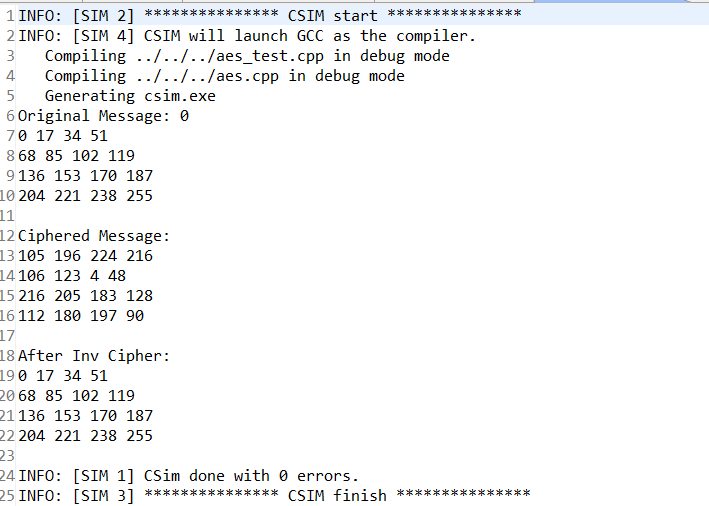
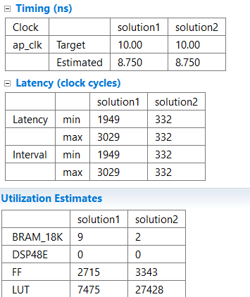
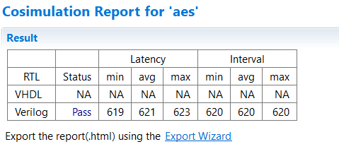
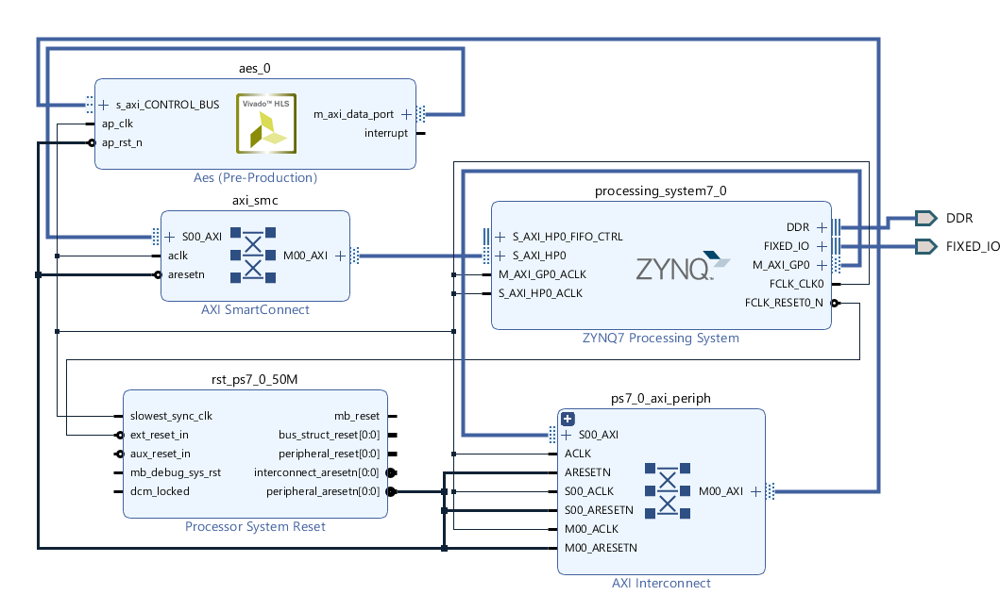

# Xilinx暑期项目

## 项目概要
    本项目主要使用Xilinx HLS实现了AES算法，并针对其中部分内容进行了优化。
    
## 使用的工具版本
    Xilinx Vivado 2018.3
    Xilinx Vivado HLS 2018.3
      
## 小组成员列表
    组长：胡鹏       学号：20BO036A
    组员：张聪武      学号：20BO037A
      
## 板卡型号与外设列表
    型号：Pynq-Z2
 
## 仓库目录介绍
- SourceCode目录存放了aes.cpp、aes.h、aes_test.cpp三个文件。
    - 其中aes.cpp为项目文件，void aes(data_t in[16], data_t out[16], m_t mode)函数为顶层函数，参数in，out对应输入输出，mode对应加解密模式，其中mode=0为加密，mode=1为解密。
    - aes.h中定义了常用的数据类型以及顶层函数。
    - aes_test.cpp中对aes.cpp功能进行了模拟测试，测试结果如图所示，可以看出加解密之后数据不变。
    
    
- images目录存放了使用到的截图
- ExecutableFiles存放了Vivado工程生成的比特流文件。
 
 ## 作品照片
- HLS优化与直接实现的对比如图所示
 
 
- RTL和C Co-Simulation结果如图所示
 
 
- Vivado工程block design结构如图所示
 
 
